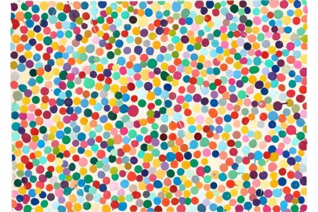
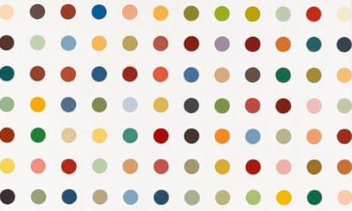

# 🎨 Hirst Painting Project


A colorful dot-painting generator created with Python's `turtle` module.

The project is inspired by the spot paintings of British artist **Damien Hirst**. The program creates a grid of randomly colored dots using a color palette extracted from an image.

---

## 📸 Project Preview

The program draws a **13 × 13 grid** containing randomly colored dots.

Each dot:

- has a diameter of 20 pixels
- is placed 50 pixels apart
- receives a randomly selected RGB color
- is drawn without connecting lines

---

## 🖼️ Color Palette Inspiration

These reference images were used to study the dot-painting style and extract the RGB color palette with `colorgram.py`.

<p align="center">
  
  
</p>

The extracted RGB values were saved in `color_list`, so the program does not need to process the images every time it runs.

> **Important:** Keep `blob_image.jpg` and `image.jpg` in the same GitHub folder as `README.md` so the images are displayed correctly.

---

## ✨ Features

- Creates a Hirst-inspired dot painting
- Uses Python's built-in `turtle` graphics module
- Selects a new random color for every dot
- Uses RGB colors with values between 0 and 255
- Draws 13 rows with 13 dots in each row
- Moves the turtle without drawing connecting lines
- Uses coordinates to position every row correctly
- Keeps the window open until the user clicks

---

## 🧠 Python Concepts Practised

This project demonstrates:

- functions
- nested `for` loops
- lists
- tuples
- random selection
- RGB color values
- turtle coordinates
- importing modules
- function calls
- comments and documentation

---

## 🛠️ Technologies and Libraries

- Python 3
- Turtle
- Random
- Colorgram.py

The `turtle` and `random` modules are included with Python.

`colorgram.py` was used during development to extract an RGB color palette from an image.

---

## 📂 Project Structure

```text
hirst_painting/
│
├── main.py
├── blob_image.jpg
├── image.jpg
└── README.md
```

The image files are only required when extracting a new color palette with `colorgram.py` or when displaying them inside the README.

The finished Python program uses the RGB colors already stored in `color_list`.

---

## 🚀 Installation

### 1. Clone the repository

```bash
git clone https://github.com/your-username/hirst-painting.git
```

### 2. Open the project folder

```bash
cd hirst-painting
```

### 3. Install Colorgram

This step is only necessary when you want to extract colors from your own image.

```bash
pip install colorgram.py
```

### 4. Run the program

```bash
python main.py
```

---

## 💻 Python Code

```python
# import colorgram
#
# rgb_colors = []
#
# colors = colorgram.extract("blob_image.jpg", 30)
#
# for color in colors:
#     r = color.rgb.r
#     g = color.rgb.g
#     b = color.rgb.b
#     new_color = (r, g, b)
#     rgb_colors.append(new_color)
#
# print(rgb_colors)

"""Colorgram was used to extract the color palette from a JPG image."""

import turtle as t
import random


color_list = [
    (248, 238, 219),
    (223, 155, 90),
    (214, 240, 228),
    (240, 206, 90),
    (104, 170, 203),
    (36, 109, 149),
    (199, 227, 239),
    (113, 193, 161),
    (153, 61, 94),
    (208, 78, 109),
    (243, 215, 226),
    (25, 134, 101),
    (224, 81, 59),
    (205, 133, 155),
    (184, 59, 43),
    (177, 166, 36),
    (138, 219, 198),
    (39, 54, 113),
    (238, 161, 180),
    (105, 40, 73),
    (137, 215, 228),
    (239, 168, 157),
    (14, 93, 69),
    (60, 166, 132),
    (27, 47, 88),
    (53, 157, 186),
    (109, 116, 170),
    (72, 36, 65),
    (14, 69, 51),
    (180, 186, 218),
]

tim = t.Turtle()
tim.shape("turtle")
tim.speed(0)
tim.pensize(2)

t.colormode(255)
tim.penup()


def random_color():
    """Return one random RGB color from the color list."""
    return random.choice(color_list)


def draw_hirst():
    """Draw a 13 × 13 grid of randomly colored dots."""
    start_x = -300
    start_y = -300

    tim.goto(start_x, start_y)

    for row in range(13):
        for dot in range(13):
            tim.dot(20, random_color())
            tim.forward(50)

        # Return to the left and move to the next upper row
        tim.goto(start_x, start_y + (row + 1) * 50)


draw_hirst()

screen = t.Screen()
screen.exitonclick()
```

---

## 🔍 How the Program Works

### RGB color mode

```python
t.colormode(255)
```

Turtle normally expects RGB values between `0.0` and `1.0`.

Setting the color mode to `255` allows colors such as:

```python
(223, 155, 90)
```

---

### Random colors

```python
def random_color():
    return random.choice(color_list)
```

Every time this function is called, Python selects one random RGB tuple from `color_list`.

The function is called separately for every dot:

```python
tim.dot(20, random_color())
```

---

### Preventing connecting lines

```python
tim.penup()
```

The turtle can move across the canvas without drawing lines between the dots.

---

### Drawing rows and columns

```python
for row in range(13):
    for dot in range(13):
```

The outer loop creates 13 rows.

The inner loop creates 13 dots in every row.

This produces:

```text
13 × 13 = 169 dots
```

---

### Moving to the next row

```python
tim.goto(start_x, start_y + (row + 1) * 50)
```

After finishing one row, Tim:

1. returns to the original horizontal starting position
2. moves 50 pixels upward
3. begins drawing the next row

---

## 🎯 Learning Outcomes

Through this project, I learned how to:

- use nested loops to create a grid
- move a turtle using screen coordinates
- prevent the turtle from drawing while moving
- work with RGB color tuples
- choose random values from a list
- extract colors from an image
- divide a drawing program into reusable functions

---

## 🔮 Possible Improvements

Future versions could include:

- user-defined numbers of rows and columns
- adjustable dot sizes and spacing
- different canvas background colors
- automatic centering of the painting
- exporting the finished artwork as an image
- generating a different painting every time the program starts

---

## 🎨 Inspiration

This project was inspired by the spot paintings of British artist **Damien Hirst**.

The program is an educational coding exercise and is not an official reproduction of any specific artwork.

---

## 📚 Sources and Documentation

- [Damien Hirst – Wikipedia](https://de.wikipedia.org/wiki/Damien_Hirst)
- [Python Turtle Documentation](https://docs.python.org/3/library/turtle.html)
- [Turtle `goto()` Documentation](https://docs.python.org/3/library/turtle.html#turtle.goto)
- [Colorgram.py on PyPI](https://pypi.org/project/colorgram.py/)
- [W3Schools RGB Colors](https://www.w3schools.com/colors/colors_rgb.asp)

---

## 👩‍💻 Author

Created as part of my Python learning journey.
